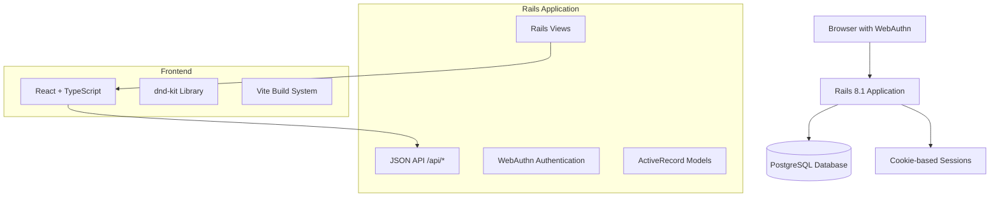

# Design Document

## Overview

The Passkey ToDo Board is a full-stack web application built with Ruby on Rails 8.1 and React, featuring passwordless authentication via WebAuthn Passkeys. The application provides a GitHub Issues-like interface for managing personal todo lists with drag-and-drop reordering capabilities.

The architecture follows a traditional Rails application pattern with JSON API endpoints for React frontend communication, cookie-based session management, and PostgreSQL for data persistence.

## Architecture

### High-Level Architecture



### Technology Stack

- **Backend**: Ruby on Rails 8.1 (full-stack mode, not API-only)
- **Frontend**: React with TypeScript, integrated via vite-ruby
- **Database**: PostgreSQL
- **Authentication**: WebAuthn/Passkeys with cookie sessions
- **Drag & Drop**: dnd-kit library
- **Deployment**: Render platform
- **Development**: Docker Compose

## Components and Interfaces

### Backend Components

#### 1. Authentication System
- **WebAuthn Controller**: Handles registration and authentication flows
- **Session Management**: Cookie-based session storage
- **Authorization**: Ensures users can only access their own todos

#### 2. Todo Management System
- **Todo Controller**: CRUD operations for todos
- **Reorder Controller**: Handles drag-and-drop position updates
- **Authorization Filters**: Ensures proper data isolation

#### 3. Data Models
- **User Model**: Minimal user representation (ID only)
- **Credential Model**: WebAuthn credential storage
- **Todo Model**: Task items with position ordering

### Frontend Components

#### 1. Authentication Components
- **LoginForm**: Passkey authentication interface
- **RegistrationForm**: Passkey creation interface

#### 2. Todo Management Components
- **TodoList**: Main interface with drag-and-drop
- **TodoItem**: Individual todo display and editing
- **TodoForm**: New todo creation

#### 3. Utility Components
- **ErrorBoundary**: Global error handling
- **LoadingStates**: User feedback during operations

## Data Models

### User Model
```ruby
class User < ApplicationRecord
  has_many :credentials, dependent: :destroy
  has_many :todos, dependent: :destroy
  
  # No email, username, or password fields
  # Identified solely by internal ID
end
```

### Credential Model (WebAuthn)
```ruby
class Credential < ApplicationRecord
  belongs_to :user
  
  # WebAuthn credential data
  # credential_id: string (unique identifier)
  # public_key: text (public key for verification)
  # sign_count: integer (replay attack prevention)
  # created_at: timestamp
end
```

### Todo Model
```ruby
class Todo < ApplicationRecord
  belongs_to :user
  
  enum status: { open: 0, done: 1 }
  
  validates :title, presence: true
  validates :position, presence: true, uniqueness: { scope: :user_id }
  
  scope :ordered, -> { order(:position) }
end
```

### Database Schema
```sql
-- Users table (minimal)
CREATE TABLE users (
  id BIGSERIAL PRIMARY KEY,
  created_at TIMESTAMP NOT NULL,
  updated_at TIMESTAMP NOT NULL
);

-- WebAuthn credentials
CREATE TABLE credentials (
  id BIGSERIAL PRIMARY KEY,
  user_id BIGINT NOT NULL REFERENCES users(id),
  credential_id VARCHAR NOT NULL UNIQUE,
  public_key TEXT NOT NULL,
  sign_count INTEGER DEFAULT 0,
  created_at TIMESTAMP NOT NULL,
  updated_at TIMESTAMP NOT NULL
);

-- Todos
CREATE TABLE todos (
  id BIGSERIAL PRIMARY KEY,
  user_id BIGINT NOT NULL REFERENCES users(id),
  title VARCHAR NOT NULL,
  status INTEGER DEFAULT 0, -- 0: open, 1: done
  position INTEGER NOT NULL,
  created_at TIMESTAMP NOT NULL,
  updated_at TIMESTAMP NOT NULL,
  
  UNIQUE(user_id, position)
);
```
## Correctness Properties

*A property is a characteristic or behavior that should hold true across all valid executions of a system-essentially, a formal statement about what the system should do. Properties serve as the bridge between human-readable specifications and machine-verifiable correctness guarantees.*

### Property Reflection

After reviewing all testable properties from the prework analysis, several can be consolidated to eliminate redundancy:

- Authentication flow properties (1.1, 1.2, 1.3, 2.1, 2.2, 2.3) can be combined into comprehensive authentication properties
- Todo CRUD properties (3.1, 3.4, 4.1, 4.2, 5.1) can be consolidated into data persistence properties
- Authorization properties (3.5, 4.3, 5.3, 10.1, 10.2, 10.3, 10.4, 10.5) can be unified into data isolation properties
- Error handling properties (1.5, 2.4, 4.4, 5.4, 6.4, 7.4, 8.1, 8.2, 8.3, 8.4) can be grouped by error type

### Core Properties

**Property 1: WebAuthn Registration Flow**
*For any* valid WebAuthn registration request, the system should generate a secure challenge, verify the credential response, create a user record, and establish an authenticated session
**Validates: Requirements 1.1, 1.2, 1.3**

**Property 2: WebAuthn Authentication Flow**
*For any* valid WebAuthn authentication request, the system should generate a secure challenge, verify the signature, and establish an authenticated session with proper redirection
**Validates: Requirements 2.1, 2.2, 2.3**

**Property 3: Todo Creation and Persistence**
*For any* authenticated user and valid todo title, creating a todo should result in a persisted record with "open" status and the next available position in the user's list
**Validates: Requirements 3.1, 3.2, 3.4**

**Property 4: Input Validation**
*For any* empty or whitespace-only todo title, the system should reject creation and display appropriate validation errors
**Validates: Requirements 3.3**

**Property 5: Todo Modification Persistence**
*For any* authenticated user's todo and valid modification (title or status), the change should be immediately persisted and retrievable
**Validates: Requirements 4.1, 4.2**

**Property 6: Data Isolation**
*For any* authenticated user, all todo operations (read, create, update, delete) should only affect todos belonging to that user and reject attempts to access other users' data
**Validates: Requirements 4.3, 5.3, 10.1, 10.2, 10.3, 10.4**

**Property 7: Authentication Enforcement**
*For any* unauthenticated request to protected resources, the system should reject the request and redirect to authentication
**Validates: Requirements 3.5, 10.5**

**Property 8: Todo Deletion and Position Integrity**
*For any* authenticated user's todo deletion, the todo should be permanently removed while maintaining valid position values for remaining todos
**Validates: Requirements 5.1, 5.2**

**Property 9: Drag-and-Drop Reordering**
*For any* authenticated user's todo list and valid position change, dragging a todo to a new position should update affected position values and persist the new order
**Validates: Requirements 6.1, 6.2**

**Property 10: Reorder Persistence Round-Trip**
*For any* todo list after reordering, reloading the page should display todos in the same order as after the reorder operation
**Validates: Requirements 6.3**

**Property 11: Position Conflict Resolution**
*For any* position conflicts that occur during reordering, the system should resolve them by recalculating position values to maintain unique, sequential ordering
**Validates: Requirements 6.5**

**Property 12: Session Management**
*For any* authenticated user, logout should destroy the session and prevent access to protected resources until re-authentication
**Validates: Requirements 7.1, 7.3**

**Property 13: WebAuthn Security Properties**
*For any* WebAuthn challenge generation, the challenge should be cryptographically secure, single-use, and time-limited
**Validates: Requirements 9.1**

**Property 14: Credential Storage Security**
*For any* stored WebAuthn credential, only public key material should be persisted on the server, never private keys
**Validates: Requirements 9.2**

**Property 15: Authentication Validation**
*For any* WebAuthn authentication attempt, the system should verify both challenge freshness and signature validity before establishing sessions
**Validates: Requirements 9.3**

## Error Handling

### Error Categories

1. **Network Errors**: Connection failures, timeouts, server unavailability
2. **Authentication Errors**: Invalid credentials, expired sessions, WebAuthn failures
3. **Validation Errors**: Invalid input data, constraint violations
4. **Authorization Errors**: Insufficient permissions, cross-user access attempts
5. **System Errors**: Database failures, internal server errors

### Error Handling Strategy

- **User-Facing Errors**: Display clear, actionable messages without exposing technical details
- **System Errors**: Log detailed information for debugging while showing generic user messages
- **Recovery Mechanisms**: Provide retry options where appropriate, maintain UI state consistency
- **Security Errors**: Log security violations, redirect to appropriate authentication flows

### Specific Error Scenarios

- **WebAuthn Not Supported**: Detect browser compatibility and guide users to supported browsers
- **Network Failures**: Show retry options, cache operations where possible
- **Concurrent Modifications**: Handle optimistic locking conflicts gracefully
- **Session Expiration**: Detect expired sessions and prompt for re-authentication

## Testing Strategy

### Dual Testing Approach

The application will use both unit testing and property-based testing to ensure comprehensive coverage:

- **Unit tests** verify specific examples, edge cases, and error conditions
- **Property tests** verify universal properties that should hold across all inputs
- Together they provide comprehensive coverage: unit tests catch concrete bugs, property tests verify general correctness

### Property-Based Testing

**Framework**: We will use the `rspec-quickcheck` gem for Ruby property-based testing, which integrates well with RSpec and provides good random data generation capabilities.

**Configuration**: Each property-based test will run a minimum of 100 iterations to ensure thorough coverage of the input space.

**Test Tagging**: Each property-based test will be tagged with a comment explicitly referencing the correctness property from this design document using the format: `**Feature: passkey-todo-board, Property {number}: {property_text}**`

**Implementation Requirements**:
- Each correctness property must be implemented by a single property-based test
- Tests should generate realistic random data within valid input constraints
- Edge cases identified in the prework analysis will be handled by the random generators

### Unit Testing

**Framework**: Standard RSpec for Rails applications

**Coverage Areas**:
- Model validations and associations
- Controller authorization and error handling
- WebAuthn integration points
- API response formats
- Session management

**Integration Points**:
- WebAuthn registration and authentication flows
- Todo CRUD operations with proper authorization
- Drag-and-drop reordering API endpoints

### Test Organization

```
spec/
├── models/
│   ├── user_spec.rb
│   ├── credential_spec.rb
│   └── todo_spec.rb
├── controllers/
│   ├── api/webauthn_controller_spec.rb
│   ├── api/todos_controller_spec.rb
│   └── api/reorder_controller_spec.rb
├── properties/
│   ├── authentication_properties_spec.rb
│   ├── todo_management_properties_spec.rb
│   ├── authorization_properties_spec.rb
│   └── reordering_properties_spec.rb
└── integration/
    ├── authentication_flow_spec.rb
    └── todo_management_flow_spec.rb
```

## API Design

### Authentication Endpoints

```
POST /api/webauthn/registration/options
POST /api/webauthn/registration/verify
POST /api/webauthn/authentication/options
POST /api/webauthn/authentication/verify
POST /api/logout
```

### Todo Management Endpoints

```
GET    /api/todos           # List user's todos
POST   /api/todos           # Create new todo
PATCH  /api/todos/:id       # Update todo (title/status)
DELETE /api/todos/:id       # Delete todo
PATCH  /api/todos/reorder   # Bulk position updates
```

### Request/Response Formats

#### Todo List Response
```json
{
  "todos": [
    {
      "id": 1,
      "title": "Complete project",
      "status": "open",
      "position": 1,
      "created_at": "2024-01-01T10:00:00Z"
    }
  ]
}
```

#### Reorder Request
```json
{
  "updates": [
    { "id": 1, "position": 2 },
    { "id": 2, "position": 1 }
  ]
}
```

## Frontend Architecture

### Component Hierarchy

```
App
├── AuthenticationProvider
├── Router
│   ├── LoginPage
│   │   ├── PasskeyRegistration
│   │   └── PasskeyAuthentication
│   ├── TodoListPage
│   │   ├── TodoForm
│   │   ├── TodoList (DnD enabled)
│   │   │   └── TodoItem[]
│   │   └── TodoFilters
│   └── AccountPage
│       └── LogoutButton
└── ErrorBoundary
```

### State Management

- **Authentication State**: React Context for user session
- **Todo State**: Local component state with API synchronization
- **UI State**: Local state for loading, errors, drag operations

### Drag and Drop Implementation

Using `@dnd-kit/core` and `@dnd-kit/sortable`:

```typescript
// Simplified DnD structure
const TodoList = () => {
  const [todos, setTodos] = useState<Todo[]>([]);
  
  const handleDragEnd = (event: DragEndEvent) => {
    // Calculate new positions
    // Send reorder API request
    // Update local state on success
  };
  
  return (
    <DndContext onDragEnd={handleDragEnd}>
      <SortableContext items={todos}>
        {todos.map(todo => (
          <SortableTodoItem key={todo.id} todo={todo} />
        ))}
      </SortableContext>
    </DndContext>
  );
};
```

## Security Considerations

### WebAuthn Security

- **Challenge Generation**: Use cryptographically secure random number generation
- **Challenge Storage**: Store challenges temporarily with expiration (5 minutes max)
- **Replay Protection**: Implement sign count verification for credentials
- **Origin Validation**: Strict origin and RP ID validation

### Session Security

- **Cookie Configuration**:
  - `HttpOnly: true` (prevent XSS access)
  - `SameSite: Lax` (CSRF protection)
  - `Secure: true` (production only, HTTPS)
- **Session Expiration**: Reasonable timeout with renewal on activity
- **CSRF Protection**: Rails standard CSRF tokens for state-changing operations

### Data Protection

- **Authorization**: Every data access verified against user ownership
- **Input Validation**: Server-side validation for all user inputs
- **SQL Injection**: Use parameterized queries (ActiveRecord default)
- **XSS Prevention**: Proper output encoding in React components

## Deployment Architecture

### Render Configuration

```yaml
# render.yaml
services:
  - type: web
    name: passkey-todo-board
    env: ruby
    buildCommand: bundle install && npm install && npm run build
    startCommand: bundle exec rails server -p $PORT
    envVars:
      - key: RAILS_ENV
        value: production
      - key: DATABASE_URL
        fromDatabase:
          name: passkey-todo-board-db
          property: connectionString

databases:
  - name: passkey-todo-board-db
    databaseName: passkey_todo_board_production
    user: passkey_todo_board
```

### Environment Variables

- `DATABASE_URL`: PostgreSQL connection string
- `RAILS_MASTER_KEY`: Rails credentials encryption key
- `WEBAUTHN_ORIGIN`: Application origin for WebAuthn
- `WEBAUTHN_RP_ID`: Relying party identifier

### Build Process

1. Bundle Ruby dependencies
2. Install Node.js dependencies
3. Build React assets with Vite
4. Precompile Rails assets
5. Run database migrations
6. Start Rails server

## Development Environment

### Docker Compose Setup

```yaml
version: '3.8'
services:
  web:
    build: .
    ports:
      - "3000:3000"
    depends_on:
      - db
    environment:
      - DATABASE_URL=postgresql://postgres:password@db:5432/passkey_todo_board_development
    volumes:
      - .:/app
      - bundle_cache:/usr/local/bundle
      
  db:
    image: postgres:15
    environment:
      - POSTGRES_PASSWORD=password
      - POSTGRES_DB=passkey_todo_board_development
    volumes:
      - postgres_data:/var/lib/postgresql/data
    ports:
      - "5432:5432"

volumes:
  postgres_data:
  bundle_cache:
```

### Development Workflow

1. `docker-compose up --build` - Start all services
2. `docker-compose exec web rails db:create db:migrate` - Setup database
3. `docker-compose exec web rails db:seed` - Load sample data (optional)
4. `docker-compose exec web rspec` - Run tests

### Local HTTPS for WebAuthn

WebAuthn requires HTTPS in production but allows localhost in development. For testing with real domains locally, use tools like `mkcert` to generate local SSL certificates.